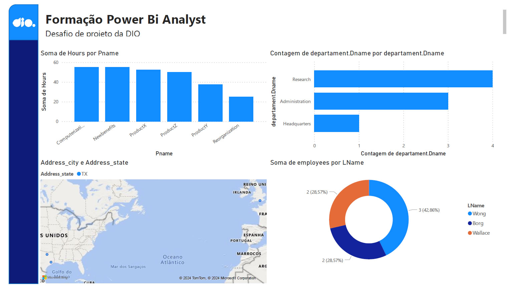

# DESAFIO POWERBI #
## Transformação de Dados utilizando banco de dados MySQL ##

Neste desafio foi criado um banco de dados MySQL num servidor externo e foi feita a conexão utilizando o PowerBi. Algumas transformações foram feitas no PowerQuery e um relatório com alguns visuais foi feito apenas para validar a correta importação dos dados.



Tabelas criadas no banco de dados MySQL
- employee
- departament
- dept_locations
- project
- works_on
- dependent

Diretrizes para transformação dos dados solicitadas no desafio

**1. Verifique os cabeçalhos e tipos de dados**
 ``` 
explain employee
 ``` 

| Nome       | Tipo de Dados |
| ---------- | ------------- |
| Fname      | varchar(15)   |
| Minit	     | char(1)	YES  |
| Lname	     | varchar(15)   |
| Ssn	     | char(9)       |
| Bdate	     | date          |
| Address    | varchar(30)   |
| Sex	     | char(1)       |
| Salary     | decimal(10,2) |
| Super_ssn	 | char(9)       |
| Dno        | int(11)       |

 ``` 
explain departament
 ``` 

| Nome             | Tipo de Dados |
| ---------------- | ------------- |
| Dname            | varchar(15)   |
| Dnumber          | int(11)       |
| Mgr_ssn          | char(9)       |
| Mgr_start_date   | date          |
| Dept_create_date | date          |

explain dept_locations

| Nome       | Tipo de Dados |
| ---------- | ------------- |
| Dnumber    | 	int(11)      |
| Dlocation  | 	varchar(15)  |

 ``` 
explain project
 ``` 

| Nome       | Tipo de Dados |
| ---------- | ------------- |
| Pname      | 	varchar(15)  |
| Pnumber    | 	int(11)      |
| Plocation  | 	varchar(15)  |
| Dnum       | 	int(11)      |

 ``` 
explain works_on
 ``` 

| Nome       | Tipo de Dados |
| ---------- | ------------- |
| Essn       | char(9)       |
| Pno        | int(11)       |
| Hours      | decimal(3,1)  | 

 ``` 
explain dependent
 ``` 

| Nome           | Tipo de Dados |
| -------------- | ------------- |
| Essn           | char(9)       |
| Dependent_name | varchar(15)   |
| Sex            | char(1)       |
| Bdate          | date          |
| Relationship   | varchar(8)    |


**2. Modifique os valores monetários para o tipo double preciso**
- Feito na coluna salary da tabela employee
**3. Verifique a existência dos nulos e analise a remoção**
- O campo nulo localizado nção foi removido

Os registros com campos nulos são:
employee - Campo Super_ssn para o registro com Ssn 888665555 
Demais tabelas não possuem campos nulos.

**4. Os employees com nulos em Super_ssn podem ser os gerentes. Verifique se há algum colaborador sem gerente**

GERENTES (1)
 ``` 
- SELECT * FROM `employee` WHERE Super_ssn is null
 ``` 
- SSN: 888665555


**5. Verifique se há algum departamento sem gerente**

NÃO EXISTEM DEPARTAMENTO SEM GERENTE
 ``` 
- SELECT * FROM `departament` WHERE Mgr_ssn not in (SELECT Ssn from employee)
 ``` 

**6. Se houver departamento sem gerente, suponha que você possui os dados e preencha as lacunas**
NÃO EXISTEM DEPARTAMENTO SEM GERENTE

**7. Verifique o número de horas dos projetos**
 ``` 
- SELECT P.PNumber, P.Pname, SUM(W.Hours) as Hours FROM project as P INNER JOIN works_on as W ON P.PNumber = W.Pno GROUP BY P.PNumber, P.Pname ORDER BY SUM(W.Hours) DESC
 ``` 

**8. Separar colunas complexas**
- A coluna Address da tabela employee foi separada.

**9. Mesclar consultas employee e departament para criar uma tabela employee com o nome dos departamentos associados aos colaboradores. A mescla terá como base a tabela employee. Fique atento, essa informação influencia no tipo de junção**
- criada a tabela employee_department_combined
- No SQL ficaria assim:
 ``` 
- SELECT E.*, D.Dname FROM `employee` as E INNER JOIN departament as D ON E.Dno = D.Dnumber
 ``` 

**10.Neste processo elimine as colunas desnecessárias.**

**11. Realize a junção dos colaboradores e respectivos nomes dos gerentes . Isso pode ser feito com consulta SQL ou pela mescla de tabelas com Power BI. Caso utilize SQL, especifique no README a query utilizada no processo.**
 ``` 
- SELECT Fname, Minit, LName, Ssn, Bdate, Address, Sex, Salary, Dno, (select FName from employee WHERE Ssn = E.Super_ssn) as Manager FROM `employee` as E WHERE 1
 ``` 

**12. Mescle as colunas de Nome e Sobrenome para ter apenas uma coluna definindo os nomes dos colaboradores**
- Feito
- No SQL ficaria da seguinte forma:
 ``` 
SELECT CONCAT(Fname, ' ', LName) as name, Minit,Ssn,Bdate,Address,Sex,Salary,Super_ssn,Dno FROM `employee` 
 ``` 

**13.Mescle os nomes de departamentos e localização. Isso fará que cada combinação departamento-local seja único. Isso irá auxiliar na criação do modelo estrela em um módulo futuro.**
- No SQL ficaria da seguinte forma:
 ``` 
SELECT D.*, L.Dlocation FROM `departament` as D INNER JOIN dept_locations as L ON D.Dnumber = L.Dnumber
 ``` 

**14. Explique por que, neste caso supracitado, podemos apenas utilizar o mesclar e não o atribuir.**
  
**15.	Agrupe os dados a fim de saber quantos colaboradores existem por gerente**
 ``` 
SELECT E.Fname, E.LName, E.Ssn, COUNT(*) as employees FROM `employee` as E
INNER JOIN employee as E2
ON E.Ssn = E2.Super_ssn
GROUP BY E.Fname, E.LName, E.Ssn
order by  COUNT(*) DESC
 ``` 

| Nome       | Quantidade    |
| ---------- | ------------- |
| Franklin   | 3             |
| James      | 2             | 
| Jennifer   | 2             |

**16.	Elimine as colunas desnecessárias, que não serão usadas no relatório, de cada tabela**
